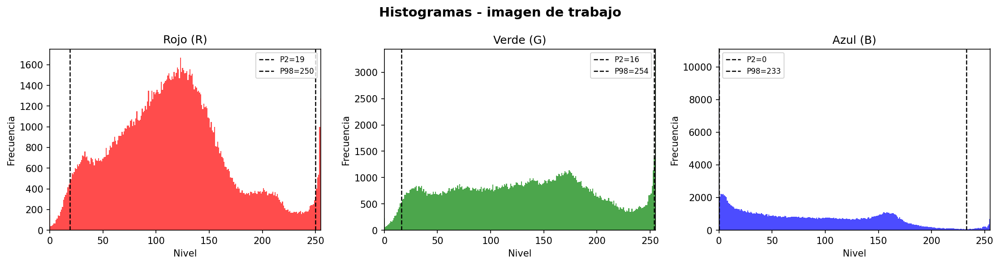
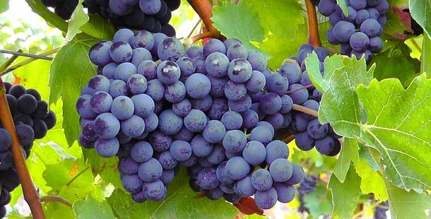
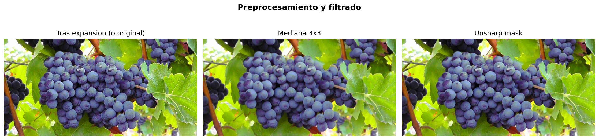
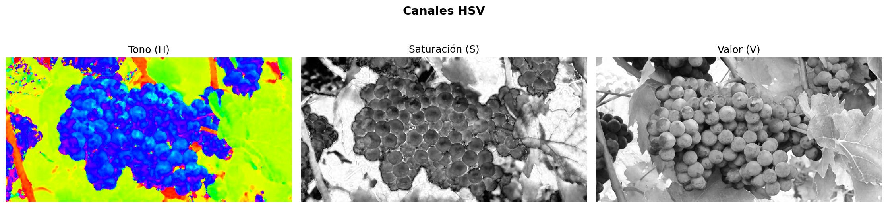
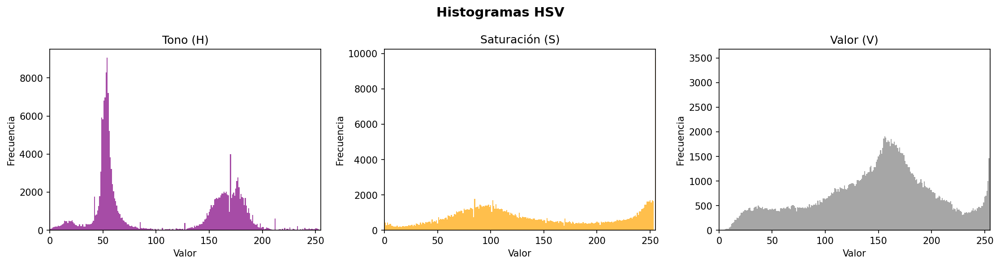
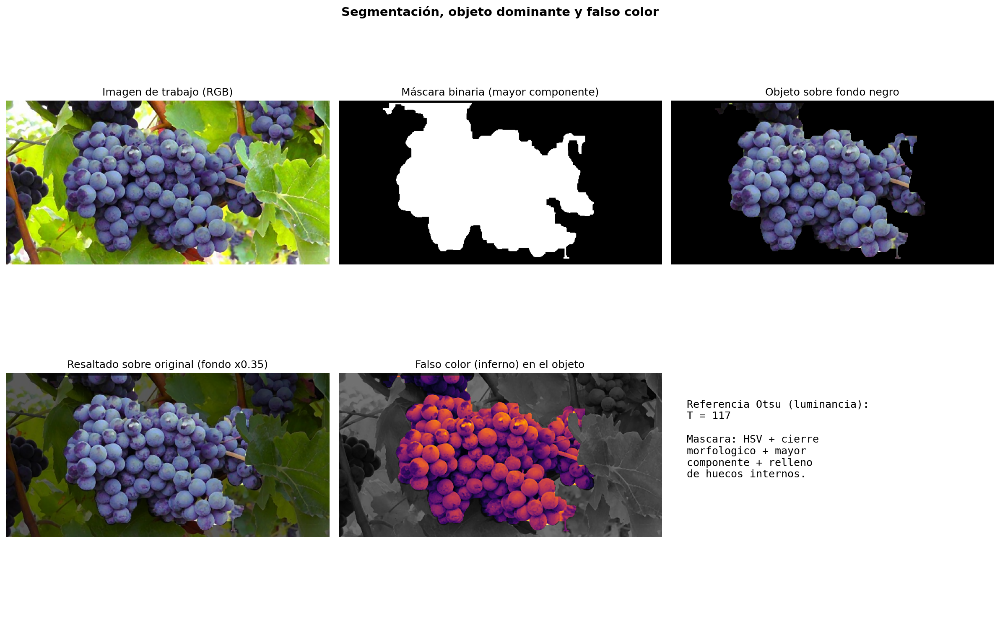
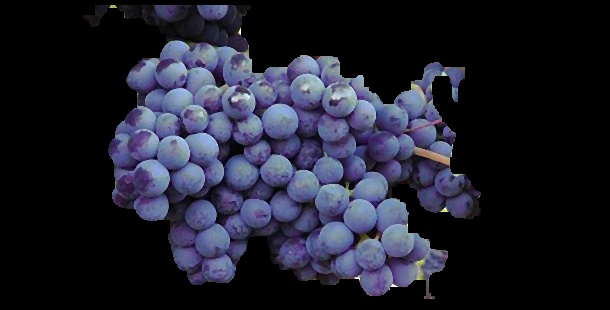
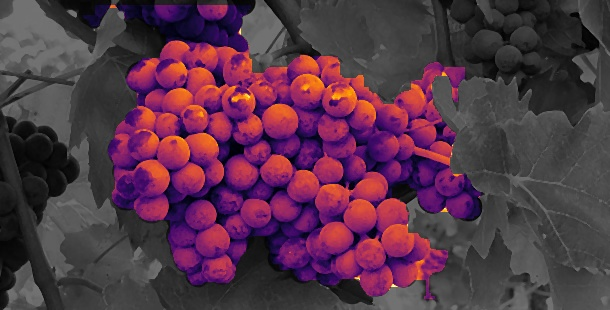

# Trabajo Práctico 4 — Procesamiento de Imágenes I

**Materia:** Procesamiento de Imágenes I  
**Integrantes:** Mateo Hernandez, Felipe Lucero  
**Repositorio en GitHub:** [github.com/mateoHernandez123/Trabajo-Practico-4-Procesamiento-de-Imagenes-1](https://github.com/mateoHernandez123/Trabajo-Practico-4-Procesamiento-de-Imagenes-1)

Este trabajo implementa un pipeline en Python: histograma y rango dinámico, estadísticos (media, desvío, moda, entropía), decisión de expansión de histograma según entropía, preprocesamiento y filtros, segmentación del racimo principal en HSV con morfología y relleno de huecos, y visualización en **falso color**.

---

## Cómo ejecutar

```bash
pip install -r requirements.txt
python tp_integrador.py
```

Instrucciones detalladas (venv, Windows/Linux, Git Bash): [docs/Readme.md](docs/Readme.md).  
Respuestas y justificaciones de la consigna: [docs/doc.md](docs/doc.md).

La carpeta `resultados/` se crea al ejecutar el script si no existe. La imagen de entrada debe estar en `imagenes/imagen_uvas.jpg` (ver [docs/Readme.md](docs/Readme.md) para usar otra ruta).

---

## Imagen de entrada

Escena elegida para aplicar todos los conceptos: racimo de uvas con follaje e iluminación natural.


**Uso en el código:** se carga en RGB desde `imagenes/imagen_uvas.jpg` y es la base de histogramas, estadísticos y segmentación.

---

## Resultados visuales (qué muestra cada una y qué técnica justifica)

### 1. Histogramas RGB — imagen original


**Qué es:** frecuencia de niveles 0–255 en R, G y B (líneas verticales P2–P98 = rango efectivo).  
**Qué justifica:** ver reparto de intensidades, picos (hojas, sombras, reflejos) y si el rango dinámico está concentrado o repartido.

---

### 2. Histogramas RGB — imagen de trabajo



**Qué es:** mismos histogramas tras la **decisión por entropía** (expansión por percentiles solo si algún canal tiene entropía bajo el umbral; si no, la imagen de trabajo coincide con la original).  
**Qué justifica:** comparar con el paso anterior y fundamentar si hizo falta estirar contraste global.

---

### 3. Imagen de trabajo guardada (JPG)



**Qué es:** la imagen que alimenta filtros y segmentación (original o expandida).  
**Qué justifica:** traza reproducible del dato intermedio entre análisis y preprocesamiento.

---

### 4. Preprocesamiento y filtros (mediana + unsharp mask)



**Qué es:** izquierda imagen de trabajo; centro **filtro de mediana 3×3** por canal (reduce ruido en sombras); derecha **unsharp mask** (realce suave de bordes).  
**Qué justifica:** la consigna pide filtros acordes al histograma/rango; acá se prioriza denoise + realce sin ecualización agresiva.

---

### 5. Canales H, S, V (espacio HSV)



**Qué es:** tono (H), saturación (S) y valor (V) tras convertir desde RGB.  
**Qué justifica:** por qué segmentamos en **HSV** (el morado del racimo se separa mejor del verde de las hojas que en un solo canal en gris).

---

### 6. Histogramas de H, S y V



**Qué es:** distribución de valores en cada canal HSV.  
**Qué justifica:** apoyar la elección de **umbrales por intervalos** en H, S y V para las uvas.

---

### 7. Resumen de segmentación y falso color



**Qué es:** panel con la imagen **tras mediana 3×3 y unsharp mask** (misma etapa que alimenta la conversión HSV), **máscara binaria** (mayor componente conexa), objeto sobre negro, resaltado con fondo atenuado (factor 0.35 fuera de la máscara), **falso color inferno** y valor de **Otsu** en luminancia (BT.601) como referencia.  
**Qué justifica:** umbralización por color + morfología (**cierre**, apertura leve) + **relleno de huecos** (`binary_fill_holes`) para incluir sombras internas del racimo; Otsu documenta un umbral global clásico aunque el método principal sea HSV.

---

### 8. Objeto segmentado (fondo negro)



**Qué es:** solo los píxeles dentro de la máscara final.  
**Qué justifica:** resultado binario / segmentación del **objeto de mayor presencia** (mayor componente conexa del color elegido).

---

### 9. Falso color sobre el objeto



**Qué es:** fondo en gris atenuado; dentro de la máscara, color según luminancia con colormap **`inferno`**.  
**Qué justifica:** la consigna pide **falso color** para que el objeto resalte; `inferno` es perceptualmente uniforme y legible.

---

## Estructura del proyecto

| Ruta                       | Contenido                                                                 |
| -------------------------- | ------------------------------------------------------------------------- |
| `README.md`                | Este archivo: resumen, figuras y estructura                             |
| `tp_integrador.py`         | Pipeline único: histogramas, estadísticos, expansión opcional, filtros, HSV, segmentación, falso color |
| `requirements.txt`         | Dependencias (`numpy`, `matplotlib`, `Pillow`, `scipy`)                   |
| `imagenes/`                | Carpeta de entrada; por defecto `imagen_uvas.jpg`                         |
| `resultados/`              | PNG y JPG generados al ejecutar (incluye `comparacion.png` solo si aplica expansión por entropía) |
| `docs/Readme.md`           | Instalación, entorno virtual y salidas de `resultados/`                   |
| `docs/doc.md`              | Informe / respuestas a la consigna                                        |
| `.gitignore`               | Excluye `venv/`, cachés de Python e ignorados de IDE                      |

Parámetros útiles en código: `IMAGE_PATH`, `ENTROPY_THRESHOLD`, umbrales `H_MIN`–`H_MAX`, `S_MIN`, `V_MIN`–`V_MAX` en `tp_integrador.py`.

---

## Clonar o actualizar desde GitHub

```bash
git clone git@github.com:mateoHernandez123/Trabajo-Practico-4-Procesamiento-de-Imagenes-1.git
cd Trabajo-Practico-4-Procesamiento-de-Imagenes-1
```
